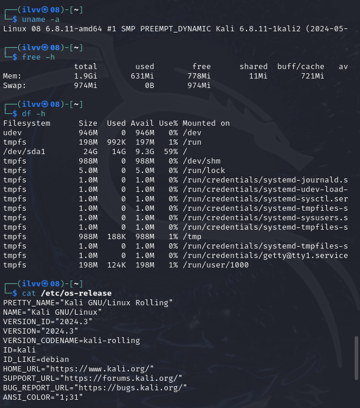

# Отчет по практической работе №2

* **Выполнил студент группы:** [3ИИС-1024]
* **ФИО:** [Буторин Максим Дмитриевич]

---
### 🛠️ Этап 1. Характеристики виртуальной машины
* **Используемый гипервизор:** [Oracle VirtualBox] <!-- MARKER_HYPERVISOR -->
* **Выделенный объем ОЗУ (RAM):** [2048 MB] <!-- MARKER_RAM -->

---
### 📸 Этап 2. Скриншот установленной ОС
 <!-- MARKER_IMAGE -->

---
### 💻 Этап 3. Системные логи диагностики оборудования
 <!-- MARKER_IMAGE -->
<!-- MARKER_LOG -->